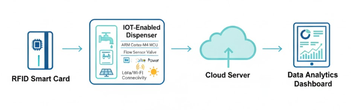
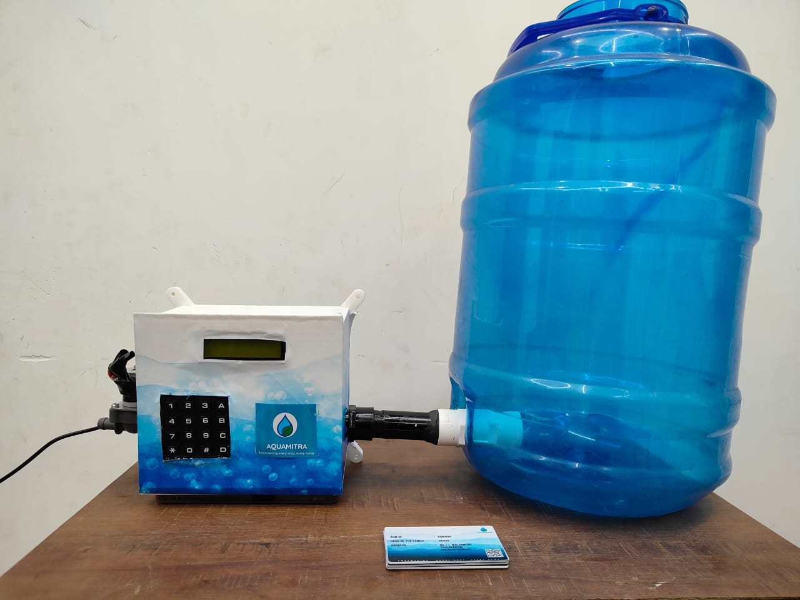

# Aquamitra 💧

## 📌 Description

A smart water system using Arduino designed specifically for rural india ,that ensures equitable and fair access to the rural communities. 

## 🔧 Components Used

* Arduino board (Uno/Nano)
* Water flow sensor
* Relay module
* solonoid valve
* RFID Reader and Card
* 9 input keypad

## ⚙️ How to Run

1. Open the project in Arduino IDE
2. Connect the circuit as shown in the diagram
3. Upload the `.ino` file to the board

## 📊 Output

* The entered amount of water dispenses until the limit of the card is reached.
* can tap the card and fetch the required water 24/7.
* The fetched quantity is deducted from the total quota of the card

## 📸 Project Images

### 🔧 Setup

### 💡 Output

### 🚀 Deployment

## 🧩 PCB Files

The Gerber files required for PCB fabrication are available in the `pcb/` folder.

## 🧱 3D Model

The enclosure for this project is available as a 3D printable STL file in the `3d-model/` folder.

